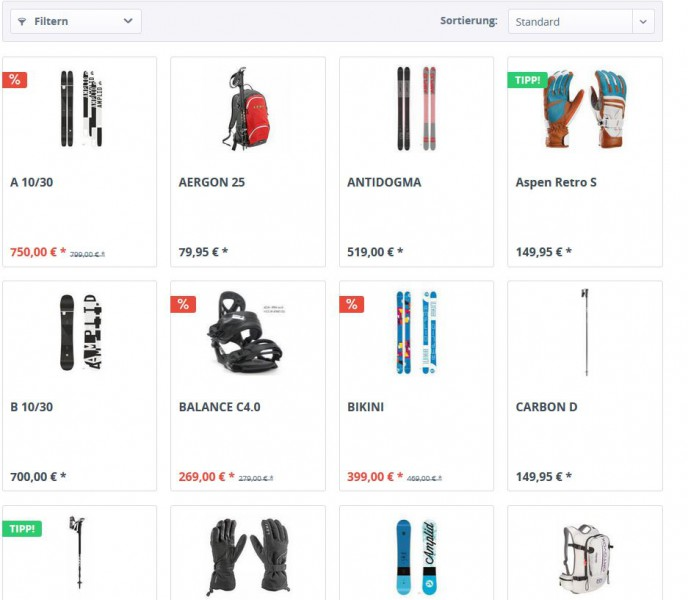

# SwagDefaultSort
> Working with Shopware version 5.0.0 to 5.2.27.
> Higher versions may work either but were not tested.

## Description 
Tired of your products being listed in an arbitrary, nonsensical order? No problem, we have you covered with our "Sort categories individually" plugin!

New functions and separate backend module.

With this new function from Shopware, customers will be able to sort the products 
contained within a category by price, brand or popularity (standard options). 
The new backend module that comes with this plugin makes it possible for you to add the new categories and other additional sorting options. 

**Increase conversion with valuable search options**
You now have the advantage of easily sorting your product display so that customers can search by the properties they value most. 
To do so, you can rely on existing criteria or create completely new attributes. 
Take for instance, a shop selling appliances: what a cool service it would be to include an "Eco-friendly grande" sorting option"

**Sort as you wish**
You can define the default listing within a category on an individual basis.
For instance, this makes it possible to sort one category by product name in ascending order, another by price in descending order. 

**Other example sorting options:**
* Attributes that have already been defined in the product listing (i.e. length and width) 
* Completely new attributes (i.e. "Certifed organic" or "Handmade")
* Average customer reviews
* Plenty more - just define the parameters

## Images

## License

The MIT License (MIT). Please see [License File](LICENSE) for more information.
